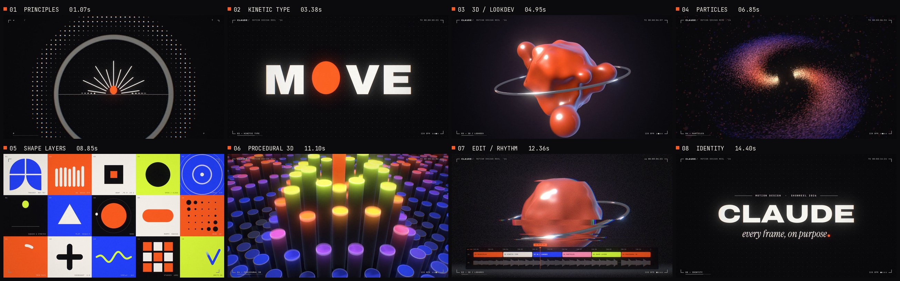
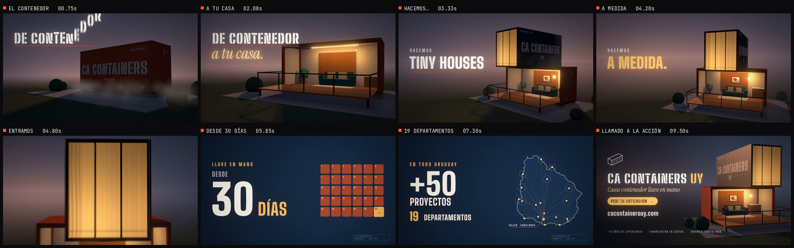

# M●VE — a 15-second motion design reel

A resume showreel, made entirely in code: **every pixel and every sound is procedural**. No footage,
no stock, no After Effects. It's a custom WebGL2 + Canvas2D renderer driven frame by frame, plus a
numpy synthesizer for the score.

**▶ [`dist/showreel.mp4`](dist/showreel.mp4)** · 1920×1080 · 60 fps · 15.0 s · H.264 + AAC



## The idea: one dot, eight disciplines

Showreels often feel like a random pile of clips. This one follows a single character, **the orange
dot**, through every technique. Each section hands off to the next with a match cut, so the reel
plays as one continuous shot.

| Time | Section | What happens | Craft on display |
|---|---|---|---|
| 0.0–2.0 | **01 Principles** | The dot pops in, anticipates, leaps, lands in a shockwave that boots the HUD, then stretches into a baseline. | Squash & stretch, anticipation, follow-through, arcs, trim-path bursts |
| 2.0–4.0 | **02 Kinetic type** | `MAKE` rises from the line. `THINGS` inflates letter by letter on real variable-font axes. `M●VE` lands and launches the dot into the O slot, then the camera dives into it. | Variable-font animation (wdth 62→125, wght 100→900), masked reveals, parallax zoom-through |
| 4.0–6.0 | **03 3D / lookdev** | The flat disc gets lit: the key light's terminator sweeps across it and reveals an iridescent 3D blob. The blob sheds liquid satellites, and a chrome ring trims itself on around it. Then it charges up. | SDF raymarching, smooth-min metaballs, thin-film iridescence, studio softbox reflections, 3D trim path |
| 6.0–8.0 | **04 Particles** | 60k embers burst out and cool from white-hot into the palette. They swirl into a two-arm vortex, tighten into a ring as the camera cranes overhead, and collapse into a disc. | Analytic particle system, differential rotation, low-discrepancy redistribution, DOF bokeh sprites |
| 8.0–10.0 | **05 Shape layers** | The disc becomes the hero of a 5×3 Bauhaus grid. Each tile loops a different motion principle and is annotated like a spec sheet. Rows shuffle, then the cards flip away in true 3D. | Easing vocabulary, staggers, morphs, trim paths, perspective card flips |
| 10.0–12.0 | **06 Procedural 3D** | **The drop.** From straight above, a halftone dot grid ripples on every kick. The camera cranes down to reveal a MoGraph pillar field, and the dot is the orange hero pillar. | Effector stack (ring waves, cross wave, noise), exact grid DDA ray-casting, soft shadows |
| 12.0–12.9 | **07 Edit / rhythm** | The whole reel scrubs backwards at 14× under an NLE timeline, while the soundtrack rewinds with it. | Re-timing, VHS glitch, 30 fps scrub cadence, tape-stop |
| 12.9–15.0 | **08 Identity** | The dot writes the name, hops down, and lands as the period of the tagline. | End-slate typography, bookended sound design |

## CA Containers UY — spot de 10 segundos (en español)

**▶ [`dist/cacontainers.mp4`](dist/cacontainers.mp4)** · 1920×1080 · 60 fps · 10,0 s · H.264 + AAC



Un spot para [cacontainersuy.com](https://cacontainersuy.com/) con la misma filosofía: todo generado por
código, imagen y sonido.

| Tiempo | Qué pasa |
|---|---|
| 0,0–1,5 | Un contenedor marítimo 20' HC cae y aterriza con polvo y un golpe metálico. Tiene el stencil **CA CONTAINERS** en el costado. Letra por letra cae **DE CONTENEDOR**. |
| 1,0–2,3 | La pared larga se abate y se convierte en deck. Se prende la luz cálida, junto con la frase *a tu casa.* Sofá, alfombra, planta, cocina, lámpara y cuadro aparecen uno por beat. |
| 2,1–4,5 | Un segundo contenedor cae cruzado encima, en voladizo, con un ventanal que se enciende. Un ticker tipo tragamonedas recorre **HACEMOS** casas / oficinas / tiny houses / depósitos / barbacoas / *a medida*. |
| 4,5–6,2 | La cámara entra por el ventanal. Un iris abre a una lámina tipo plano: **LLAVE EN MANO — DESDE 30 DÍAS**, con un calendario de 30 días que se completa y la llave en el día 30. |
| 6,2–7,6 | El mapa de Uruguay (contorno real de Natural Earth) se dibuja solo. Desde el **taller en Canelones** salen rutas a los **19 departamentos**, junto con **+50 proyectos**. |
| 7,6–10 | Cierre sobre un render hero de la casa: marca, *Casas contenedor llave en mano*, **PEDÍ TU COTIZACIÓN**, `cacontainersuy.com`, +10 años · financiación en cuotas · envíos a todo el país. |

Detalles técnicos:
* **Ray tracer analítico.** Hay 40 cajas orientadas y 8 esferas en 6 clusters con AABB. El
  corrugado es bump mapping, y el stencil y las marcas de puerta son texturas de canvas. El cielo
  es de hora azul, con luz de atardecer de contraluz.
* **Luces de área cálidas** (tira LED, lámpara, ventanal). Se muestrean estratificadas entre los
  sub-frames del motion blur, así las sombras suaves convergen sin ruido.
* **Banda sonora** a 120 BPM en Re mayor (I–vi–IV–V–I). El primer compás arranca con el golpe del
  contenedor. Hay chirrido de bisagra, golpe del deck, interruptor, pops de muebles, ticks de
  contador, *ding* de llave, 19 notas de pines y el acorde final. Normalizada a −14 LUFS.
* Datos del negocio tomados de su sitio: llave en mano desde 30 días, +50 proyectos en 19
  departamentos, +10 años, taller en Canelones y financiación en cuotas.

## How it's made

```
src/
  engine/   ease.js (Penner + cubic-bezier + closed-form springs) · noise.js · gl.js (WebGL2 toolkit)
            engine.js (sub-frame accumulation, bloom, lens, grain) · glyphs.js (variable-font outlines)
  scenes/   intro · blob · particles · bauhaus · pillars · rewind · endcard
  reel.js   master timeline: scene dispatch, camera shake, per-section look, HUD
  data/     cues.json — the shared beat/cue sheet that picture and sound both read
  reels/cacontainers/   the CA Containers UY spot: house.js (ray tracer) · graphics.js · reel.js · uruguay.json
audio/      synth.py (oscillators, filters, drums, FX, reverb, limiter) · score.py · cacontainers.py
tools/      render.mjs (headless Chromium → ffmpeg) · build.sh · glyphs.py · contact/spectrogram/loudness
```

* **Real motion blur.** Each output frame averages 8 sub-frames (16 around impacts) across a 180°
  shutter in a linear-light HDR buffer. Every sub-frame gets a Halton sub-pixel jitter, so the
  raymarched scenes are anti-aliased for free.
* **Post.** A 6-level 13-tap dual-filter bloom with a Karis-average prefilter, radial chromatic
  aberration, barrel distortion, and trauma-based camera shake driven by the impact list. Film grain
  follows luminance, and the output is dithered so dark gradients don't band. Each section gets its
  own look: the flat Bauhaus section drops bloom, CA and vignette.
* **Variable fonts in Canvas2D.** Canvas can't animate `font-variation-settings`, so
  `tools/glyphs.py` extracts Archivo's outlines on a grid of axis locations covering every master and
  avar breakpoint. `glyphs.js` interpolates them bilinearly, which gives exact variable-font shapes at
  any width and weight, per letter, per sub-frame.
* **Pillar field.** Raymarching this scene cost ~13 s/frame. It's now an exact 2D-DDA grid
  traversal with analytic ray/cylinder hits over a JS-computed height texture, which runs about
  10× faster.
* **Everything is a function of time.** No simulation state, so any frame renders independently.
  That's what makes the rewind possible: it just re-renders the reel at `src(t)`.
* **Sound sync.** The renderer exports derived event times to `audio/timings.json`: letter pops,
  tile reveals, card flips. The score places each sound on those times. The rewind audio is the mix
  itself, reversed and resampled along the same scrub curve as the picture. The master is normalized
  to −14 LUFS with a −1 dBFS ceiling. The harmony is F minor: Fm9 → D♭maj9 → A♭maj9 → E♭ → Fm, at
  120 BPM.

## Build it

Requirements: Node 18+, Python 3.10+, ffmpeg with libx264, and Chromium (Playwright).

```bash
pip install -r requirements.txt
npm i -D playwright && npx playwright install chromium   # skip if Playwright is already global
bash tools/build.sh                                         # fonts → glyphs → timings → score → frames → MP4
```

`REEL=cacontainers bash tools/build.sh` builds the CA Containers spot the same way. A full render
takes about an hour on 4 CPU cores with no GPU (WebGL runs on SwiftShader). For
fixes, `tools/splice.py` swaps re-rendered frame ranges into an existing master, so you don't need
a full pass. Useful while iterating:

```bash
python3 tools/fetch_fonts.py && python3 tools/glyphs.py          # once: fonts + variable glyph data
node tools/render.mjs stills --frames 0,120-240:10 --samples 2   # PNGs in out/stills
python3 tools/contact.py out/stills out/contact.png                # contact sheet
python3 audio/score.py && python3 tools/spectrogram.py             # score + spectrogram with cue marks
```

Fonts ([Archivo](https://fonts.google.com/specimen/Archivo),
[Instrument Serif](https://fonts.google.com/specimen/Instrument+Serif),
[JetBrains Mono](https://fonts.google.com/specimen/JetBrains+Mono)) are fetched from Google Fonts
under the SIL Open Font License. They aren't committed to this repo.
